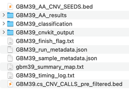
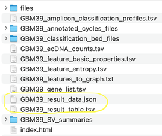
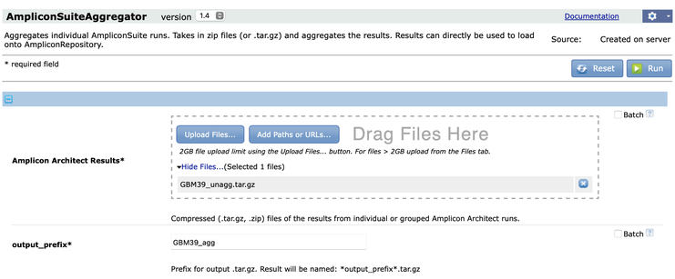

# Getting Started

### 1. Generating focal amplification predictions with AmpliconSuite-pipeline

* AmpliconSuite-pipeline wraps data preparation steps, AmpliconArchitect, and AmpliconClassifier into a single wrapper that includes all our recommended best practices and input data filtering methods.
    * Options for usage and documentation are [available on GitHub](https://github.com/AmpliconSuite/AmpliconSuite-pipeline).
* After running AmpliconSuite-pipeline, you should have a collection of AmpliconSuite-pipeline files (AmpliconArchitect outputs and associated files) for one or more samples.
    * If you used the GenePattern interface or PrepareAA.py to run AmpliconSuite-pipeline (including AmpliconClassifier), and after confirming you have the `[prefix]_result_data.json` file present, you can skip the following steps and go to #2.
    * You must run the AmpliconClassifier script `make_results_table.py` on your AmpliconClassifier files to format them in a way the site can handle.
    * Example Files:
    * 
    * Note that the classification directory will contain the `[prefix]_result_data.json/.tsv` file after running make_results_table.py on your AmpliconClassifier files. [See documentation on GitHub for an example](https://github.com/AmpliconSuite/AmpliconSuite-pipeline#packaging-outputs-for-ampliconrepository).
    * 

### 2. Aggregating results 

There are two steps for aggregating the results.

1. (Skip this step if you used the GenePattern AmpliconSuite-pipeline module and already have a .tar.gz of your outputs). Once you have one or more samples processed with AmpliconSuite-pipeline, please combine the pipeline's output files into a single .tar.gz or .zip archive file.
      * This should include:
          * AA outputs
          * AC outputs
          * CNVkit outputs or whole-genome copy number bed file.
          * (Optional) A directory of any auxilliary files (e.g. FISH images) you want packaged with the upload to share with other users. Auxilliary files must be placed in a separate directory and a file called "AUX_DIR" must be present in the top level of that directory to mark those files, otherwise they will be left behind.
      * Please ensure you do not include the original bam/fastq files in the .tar.gz or .zip you create.
      * Example .tar.gz comprised of the files shown above: 
2. Before uploading your archive to AmpRepo, you must run AmpliconSuiteAggregator on your .tar.gz/.zip to restructure the files in a way the website expects.
    * This can be done either from upload to a [GenePattern module](https://genepattern.ucsd.edu/), or [from your command-line](https://github.com/AmpliconSuite/AmpliconSuiteAggregator).
    * 
3. The result of the aggregation process will be a .tar.gz file with the aggregated results which are now ready for upload to the website.

### 3. Uploading to AmpliconRepository

* Login to AmpliconRepository.
* In the upper-right corner, click your username, and select "New Project"
* Fill out the project intake form and specify the aggregated .tar.gz file for upload.
    * Please give an accurate description in the "Description" field, preferably one that tells other users where this data came from, and what it represents.
    * Include information on how to cite the origin of the data, if relevant.
    * Note: large .tar.gz files may take a few minutes to upload. For files larger than 500Mb, please contact the site admins and we will assist with the process.

## Want to request a dataset, report a bug or give feedback?
Please reach out on the [GitHub issues page](https://github.com/AmpliconSuite/AmpliconRepository/issues).

